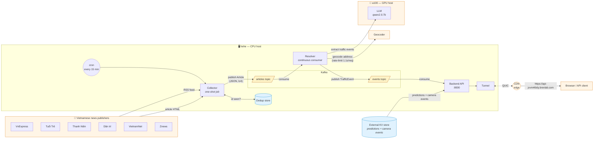

# Pipeline Architecture

End-to-end data flow: từ feed RSS của các báo điện tử, qua collector +
resolver, đến API public phục vụ client.

## Component summary

| Component | Where | Vai trò |
|---|---|---|
| Publishers | Internet | 6 báo điện tử Việt Nam, mỗi báo có 2-3 RSS feed |
| Collector | hehe | Cron-driven; poll RSS, GET article body, publish lên Kafka |
| Dedup store | hehe | Tập `id` đã publish, tránh re-publish bài cũ |
| Kafka | hehe | Broker local, 2 topic: `articles` và `events` |
| Resolver | hehe | Continuous consumer; LLM extract + geocode; publish event |
| LLM | a100 | qwen2.5:7b chạy GPU; HTTP API |
| Geocoder | external | Address → (lat, long) |
| Backend API | hehe | HTTP API; consume events vào memory + đọc KV store |
| External KV store | bên ngoài | Lưu predictions + camera events (telemetry) |
| Tunnel | hehe | Mở public URL qua tunnel |

## Endpoints

| Path | Source | Mục đích |
|---|---|---|
| `GET /cameras` | local JSON file | 220 camera HCMC |
| `GET /predictions/latest` | KV store | Latest prediction cho mọi camera |
| `GET /predictions/{id}/...` | KV store | Per-camera predictions |
| `GET /events/...` | KV store | Camera telemetry events (chưa có data) |
| `GET /news?limit=N` | Kafka `events` topic | Resolved news events từ resolver |

## Cách view diagram

- **VS Code**: cài extension "Markdown Preview Mermaid Support", mở file → Cmd-Shift-V
- **GitHub**: render trực tiếp khi push
- **Obsidian / Typora**: render native
- **Online**: copy block mermaid vào https://mermaid.live
